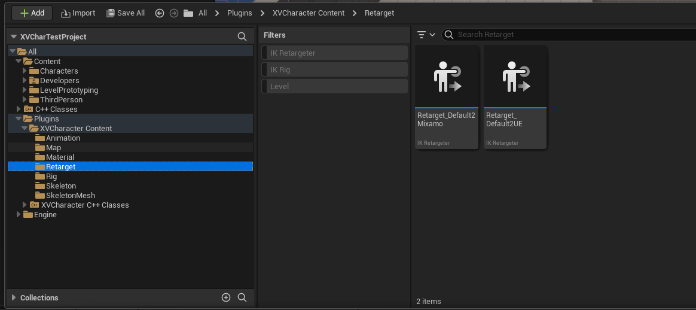

# XVERSE Character UE Plugin

[](./LICENSE)

[English](#) | [中文](./README_CN.md)

[](http://xverse.cn/)

## Introduction

XVERSE Character UE plugin (XCharacter UE Plugin) a 3D digital human creation plugin for Unreal Engine 5, developed by XVERSE Technology Inc. (Zhenshen, China). Currently, the main capability of this plugin is to provide a convenient way to acquire assets for text-generated animations. In traditional animation generation pipelines, users typically acquire animation assets by hand crafting or use motion capture devices, then import them into UE projects for editing and adjustment. Thanks to the development of generative AI tachnology, we can now use XVerse AI inference service based on physics simulation to directly obtain the desired animation asset files within the UE project by describing them in text, helping developers quickly obtain animation assets to preview effects during project iterations.

It is important to note that the plugin itself does not consume local computing resources, but rather accesses XVerse MotionGen service over Internet to obtain assets. 

Current main capabilities of the animation generation plugin include:

- Obtaining animation assets by inputting text descriptions
- Constraining the output of animations by setting parameters such as cue words and animation length
- Redirecting from raw assets to custom skeleton objects
- Converting BVH format to Animation Sequence

Future updates will include:

- [ ]  Support for motion trajectory, single-frame editing, and stylized motion blending
- [ ]  Providing a solution for high-quality video motion capture under UE locally
- [ ]  Support for motion generation capabilities with character and scene physical interactions

To facilitate developers, our future update directions will not only focus on animation generation capabilities but also provide more functions for 3D digital human asset production and editing. Stay tuned for:

- [ ]  Support for TTS voice generation and driving capabilities
- [ ]  Support for LLM-based dialogue-driven digital human systems

## Obtaining Secret Key

Currently, we provide developers with a beta sceret key, which includes 1,000 free motion inference credits.

You can obtain the key by sending an email to us, the following information is required. 

```
TO: xengine@xverse.cn

[Name]: YOUR_NAME
[Position]: YOUR_POSITION
[Company or Organization Name]: YOUR_COMPANY_NAME
[Contact Information]: YOUR_EMAIL_ADDRESS or YOUR_PHONE_NUMBER
[Purpose]: DESCRIBE_YOUR_PURPOSE
[Area of Interest]: DESCRIBE_YOUR_INTERST_AREA

```

We will respond to your request via email as soon as possible.

If you have any questions during the application process or would like to know more detailed information, you can contact our technical team by email or visit the official website of the application.

- Email address: **xengine@xverse.cn**
- Official application website: **motiongen.cn**


## Plugin Usage

### System Requirements

- Windows 10 or 11
- Unreal Engine 5.2.x-5.4.x
- Internet connection required

### Plugin Download

1. Visit GitHub [XCharacter-UEPlugin](https://github.com/xverse-engine/XCharacter-UEPlugin)
2. Download the Release plugin version corresponding to the UE version you are using
3. Extract and move the `XCharacter` folder to the `Plugins` folder in your UE project

### Configuring Access Key

Select **Edit->Project Settings**


In the project settings, find **XCharacterSettings**


Paste the key into the **Secret Key** input box, then you can close the settings page.

### Generating AI-Driven Animation

Click the 'X' button in the menu bar to open the MotionGen window.


The window contains four viewports for generating motion previews and a motion generation settings panel.


- Prompt: Enter a text description to guide AI in generating motions.
- Asset Name: Add the asset name for the generated asset.
- Animation Length: Enter the desired animation length. We currently support up to a maximum of 10 seconds per run. If you have no specific length requirements, you can also check `Use Recommend Length` to obtain the AI-recommended length of the action.
- Offset Length: Adjust `Offset Length` based on specific character model parameters to avoid foot penetration with the ground, default is a ground distance of 10cm.
- Select A Retargeter: By default, the plugin uses the preset `Default2SMPL` retargeting asset, or you can use a user-defined retargeting asset for preview. When making retargeting assets, be aware that the source skeleton should use the plugin's `/XCharacter/Skeleton` directory `Default_Skeleton` skeleton, otherwise preview and export errors may occur.

Click the `Generate` button to request output from the server. Asset generation may take several seconds to tens of seconds, depending on network status and server load, please be patient during this process.


After the download is complete, you can also view the generated effects in the preview viewport on the left. Each generation task returns four actions, each different, and you can select the most suitable action by clicking the `Export Retarget Animation` button to export to the project.

You can change the path where the animations are saved in the settings interface mentioned in Step 1. It is important to note that closing the window will clear any unsaved preview animations and their cache, so please save them promptly.


## Redirecting Animation to Custom Models

You can redirect generated animation sources to any custom model using UE's IKRetarget asset. The source skeleton IKRig asset preset by MotionGen is stored in the `/XCharacter/Rig` directory under `Rig_Default_SMPL`.


In the MotionGen window, the preview character models you see are redirected from this skeleton, and the plugin includes two default retargeting assets for demonstration, which can be found in the `/XCharacter/Retarget` directory folder.



Similarly, you can create and use retargeting assets with the MotionGen skeleton as the source skeleton.


Open the retargeting asset and check the animation by clicking the animation in the lower right corner of the asset browser.


You can export the retargeted animation sequence as a new asset referencing the source skeleton,


and also directly preview and export using a custom Retarget asset in the MotionGen window.


## Writing Prompts

MotionGen supports guiding animations like directing real actors using text descriptions. Therefore, when planning actions, integrate a variety of elements such as action type, movement direction, and emotional expression to ensure the animation's subtlety and accuracy.

Currently, the animation length range is set between 1-10s, so appropriate description length and complexity are crucial for generating good actions.

### Techniques for Describing Actions

When writing action descriptions, to convey action characteristics and background, imagine yourself as a director considering the situation facing the actors:

- Imagine what role your actor is playing
- Confirm the background where the action takes place
- Where your actors start their actions
- Their emotions
- Which arm or leg needs to be used

For example, when describing an elderly man walking, you can write:

`An old man stumbles left and right while moving forward.`

Or when describing a specific action, you can write:

`A person stands, crosses left leg in front of the right, lowering themselves until they are sitting, both hands on the floor before standing and uncrossing legs.`

Accurate descriptions help the algorithm better understand your intent, enhance the richness of your prompts by including the following elements:

- Action Type: e.g., squatting, kicking, running
- Body Parts: e.g., both arms, pelvis, left hand, right arm
- Speed: e.g., fast, sprint
- Trajectory: e.g., clockwise circle, square, back and forth
- Relative Position: e.g., to the right hand side, above the head
- Style: e.g., like a zombie, like an elderly person
- Direction: e.g., forward, clockwise, left, right, forward, backward
- Emotion: e.g., angry, joyful, listless

Note:
- Precise data: Currently, descriptions of precise distances, etc., are not supported, and the output may deviate from the text description.

For example:

`A person jumps high and spins 360 degrees to the left before landing.`

`A person move forward for 2 meters.`

It's difficult to precisely accomplish these instructions with 360 degrees or 2 meters.

### Some Counterexamples

`walk and sit`

Explanation: The description is too brief and vague, lacking clarity in execution. A better description would include the order of actions and how the character's limbs move.

`a man is eating something`

Explanation: The description is too general. Although it might yield an action that seems like eating, it's not what you wanted. Try describing how the food is being eaten, whether sitting or standing, and which hand is holding the food.

`a man is flying faster-than-light through the cosmos.`

Explanation: Actions that violate basic physical rules are hard to achieve.


[v1.0.0-alpha](https://github.com/xverse-engine/XCharacter-UEPlugin/releases/tag/V1.0.0-alpha)

- Features
   - Added Text2Motion panel
   - Added default skeleton retargeting assets

### Contributors

<a href="https://github.com/xverse-engine/XCharacter-UEPlugin/graphs/contributors">
  
</a>
