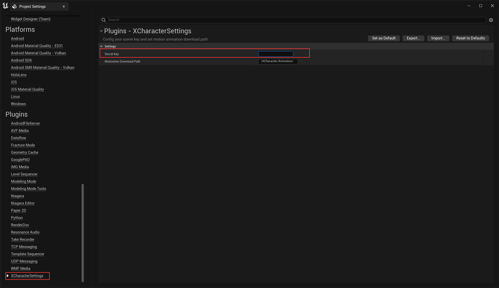
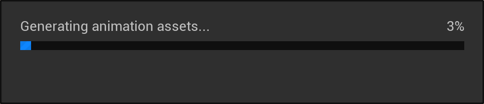
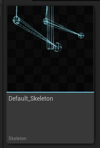
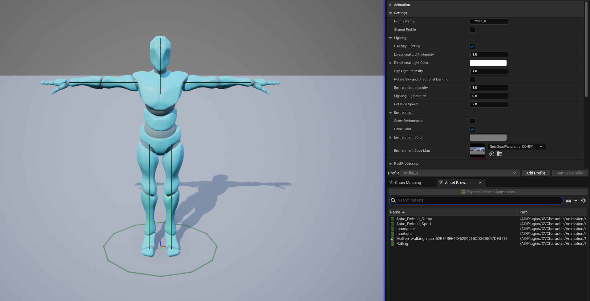
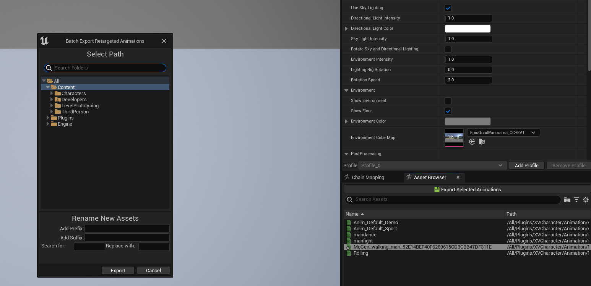

# XVERSE 角色 UE 插件

[English](#) | [中文](./README_CN.md)

## 简介

XVCharacter UE插件是由深圳市元象科技开发的用于虚幻5引擎的3D数字人制作插件。目前本插件的主要能力是提供了一种便捷的**文本生成动作**的资产获取途径。在传统的动作生成管线下，用户通常需要先手工制作或通过动捕设备获取动作数据文件，再导入到UE工程中进行编辑和调整。得益于生成式AI的发展，用户可以借助元象提供的基于物理模拟驱动的AI推理服务直接在工程内通过文字描述获取想要的动画资产文件，帮助开发者在项目迭代期间快速获取动画资产来预览效果。

需要注意的是，插件本身并不占用本地的计算资源，而是通过互联网请求的方式访问元象的动作生成服务来获取动作资产。

目前动作生成插件的主要能力： 
- 通过输入文本描述获取动画资产
- 通过设置提示词、动画长度等参数约束输出的动作
- 从原始资产重定向到自定义的骨骼对象
- 将BVH格式转换为Animation Sequence的功能

后续的更新功能

- [ ] 支持动作轨迹、单帧编辑和风格化动作混合等能力
- [ ] 提供UE本地下的高质量视频动捕的解决方案
- [ ] 支持与人物与场景物理交互下的动作生成能力

为了方便开发者，我们后续的更新方向除了对动作生成功能以外还将会提供更多的面向3D数字人资产生产和编辑的功能，敬请期待。

- [ ] 支持TTS语音生成和驱动能力
- [ ] 支持基于LLM对话驱动的数字人系统

## 获取权限密钥

目前，我们为开发者提供了内测密钥，包含了1000次免费的动作推理点数。

您可以通过填写此[问卷](https://wj.qq.com/s2/14713281/6386/)来获取内测名额。

在申请过程中若如有任何疑问或想要了解更详细的信息可以通过邮件联系我们的技术团队或访问应用的官方网站。

- 邮箱地址：**xengine@xverse.cn**
- 应用官方网站：**motiongen.cn**

## 插件使用

### 系统要求

- Windows 10 或 11
- Unreal Engine 5.2.x-5.4.x
- 需要连接互联网

### 插件下载

1. 访问 GitHub [XCharacter-UEPlugin](https://github.com/xverse-engine/XCharacter-UEPlugin)
2. 下载与您使用的 UE 版本对应的 Release 插件版本
3. 解压并将 `XVCharacter` 文件夹移动到UE项目中的 `Plugins` 文件夹中

### 配置权限密钥

选择 **编辑->项目设置** 

在项目设置中，找到 **XCharacterSettings**

将密钥粘贴到 **Secret Key** 的输入框中，完成后可以关闭设置页面。

### 生成 AI 生成动画

点击菜单栏中的 'X' 按钮打开MotionGen窗口。

窗口中包含了4个可以进行生成动作预览的视口和动作生成设置参数面板。

- Prompt(提示词)：输入指导AI生成动作的文本描述。

- Asset Name(资产名称)：添加生成资产的资产名称。

- Animation Length(动画长度)：输入想要的动画长度，目前我们支持单次运行的最大10秒动作序列，如果没有动作长度的要求，也可以勾选 `Use Recommend Length` 来获取AI推荐长度的动作。

- Offset Length(距离地面高度)：可以根据具体的人物模型参数来调整`Offset Length`来避免脚底与地面穿模，默认为距离地面高度10cm。

- Select A Retargeter(选取预览重定向资产)：默认模式下使用了插件预设的`Default2SMPL`重定向资产，也可以使用用户自定义的用户重定向资产进行预览。制作重定向资产时需要注意源骨骼应当使用插件 `/XCharacter/Skeleton`目录下`Default_Skeleton`骨骼，否则可能会造成预览和导出的错误。

点击`Generate`生成按钮，插件将向服务器请求输出。可能需要十几到几十秒的时间生成资产，具体时间取决于网络状态和服务器的繁忙程度，再次过程中请耐心等待。

下载完成后便也可以在左侧的预览视口中查看生成的效果。每次生成任务MotionGen会返回4个动作，每个动作会有所不同，可以选择最适合的动作点击`Export Retarget Animation`按钮导出到项目中。

可以在Step 1中提到的设置界面来更改动画保存的路径，需要注意的是，关闭窗口后未保存的预览动画及其缓存将被清除，请及时保存。 

## 重定向动画到自定义模型

使用UE中的IKRetarget资产可以将生成的动画源重定向至任意自定义模型。MotionGen预设的源骨架IKRig资产存放在`/XCharacter/Rig`目录下的`Rig_Default_SMPL`。

在MotionGen窗口中窗口看到的预览角色模型均是由该骨架重定向而来，插件中包含了两个用于演示的默认重定向资产，可以在`/XCharacter/Retarget`路径下文件夹中找到。

类似的，你也可以创建并使用以MotionGen骨架为源骨架的重定向资产。

打开重定向资产，通过单击资产浏览器中右下角的动画来检查动画是否正确。

可以将重定向动画序列导出为引用源骨架的新资产，

也可以在MotionGen窗口中选用自定义的Retarget资产直接预览和导出。

## 提示词编写

MotionGen支持像指导真人演员那样使用文本描述的方式进行。因此在规划动作时，请合理地融入动作类型、运动方向、情感表现等多样化的元素以确保动画的细腻和准确性。

目前生成的动画长度范围规定在1-10s以内，因此合适的描述长度和复杂度对生成好的动作至关重要。

### 动作的描述技巧

在编写动作描述时，为了能传达的动作特性和背景，请想象作为导演考虑演员所面临的情况: 

- 想象你的演员要扮演什么样的角色
- 确认动作发生在什么背景下
- 你的演员是从什么位置开始他们的动作
- 他们的情绪如何
- 需要使用哪只胳膊或腿

例如：当你描述一个老人在行走时，你可以写

`An old man stumbles left and right while moving forward.`

或者当你描述一个具体动作时你可以写：

`A person stands, crosses left leg in front of the right, lowering themselves until they are sitting, both hands on the floor before standing and uncrossing legs.`

对细节的精确描述可以帮助算法更好地理解你的意图，通过包括以下元素来增强你的提示的丰富性： 

- 动作类型：例如蹲下、踢、跑 
- 身体部位：例如双臂、臀部、左手、右臂 
- 速度：例如快速、疾跑
- 轨迹：例如顺时针的圆形、方形、来回 
- 相对位置：例如右手边、头顶上方
- 风格：例如像僵尸一样，像老人一样
- 方向：例如前进、顺时针、左、右，前进，后退
- 情绪：例如愤怒、欢乐、无精打采 

注意：
- 精确数据：目前尚不支持对精确的距离等的描述，输出的结果可能会与文本的描述有偏差

例如：

`A person jumps high and spins 360 degrees to the left before landing.`

`A person move forward for 2 meters.`

最终输出的动画可能难以精确匹配到360度或2米的运动。

### 一些反例

`walk and sit`

解释：描述过于简短且含糊其辞，在执行上缺乏明确性，更好的描述方式则是增加动作的顺序描述和角色肢体如何运动的描述。

`a man is eating something`

解释：描述过于笼统，虽然也许可以得到似乎是在吃东西的动作，但是也不这并不是你想要的，尝试描述是如何吃东西的，是坐着还是站着，是用哪只手拿着食物。

`a man is flying faster-than-light through the cosmos.`

解释：不符合基本物理规则的动作很难做到。

### 发布说明

[v1.0.0-alpha](https://github.com/xverse-engine/XCharacter-UEPlugin/releases/tag/V1.0.0-alpha)

- 功能
   - 添加 Text2Motion 面板
   - 添加默认骨架重定向资产

### 贡献者

